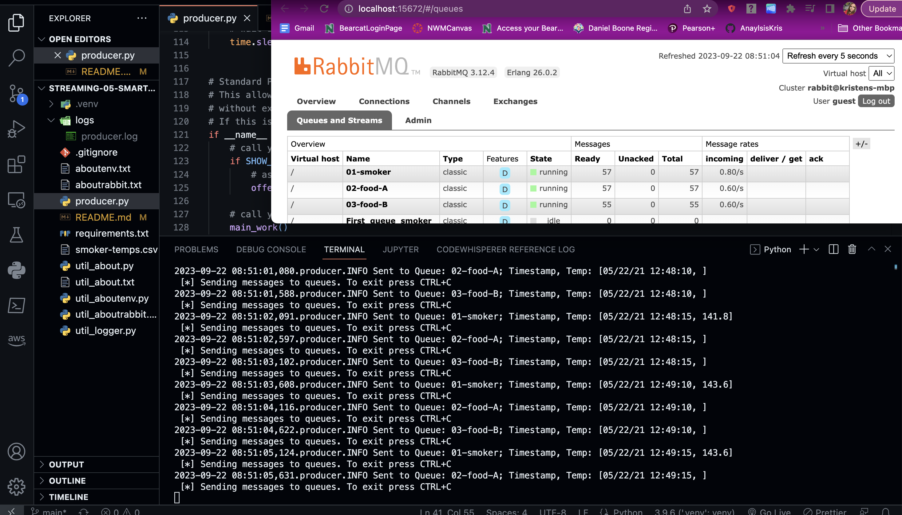

# streaming-05-smart-smoker
Understand the process of implementing analytics for a "smart smoker" (as in slow cooked food), design system, and implement the producer

- Class: STREAMING DATA 44671-80/81FA23
- Assignment: P5-- Creating a Producer
- Name: Kristen Finley
- Date: September 17, 2023

---
# Description:

Streaming data may come from web analytics, social media, smart devices, and more. In these next two modules, we'll look at implementing analytics for a "smart smoker" (as in slow cooked food). 

In Module 5, we'll understand the process, design our system, and implement the producer. In Module 6, we'll add the consumers, implementing analytics based on a rolling window of time, and raise an alert when interesting events are detected. 

Please read and follow the guidelines below. You may work on your own - or with others in the class as you like. Use the discussion forum to work together and share suggestions and questions. 

 
---
# The Problem / Challenge To Solve

## Background: Smart Smoker
---
### Using a Barbeque Smoker
When running a barbeque smoker, we monitor the temperatures of the smoker and the food to ensure everything turns out tasty. Over long cooks, the following events can happen:
1.	The smoker temperature can suddenly decline.
2.	The food temperature doesn't change. At some point, the food will hit a temperature where moisture evaporates. It will stay close to this temperature for an extended period of time while the moisture evaporates (much like humans sweat to regulate temperature). We say the temperature has stalled.
 
### Sensors
We have temperature sensors track temperatures and record them to generate a history of both (a) the smoker and (b) the food over time. These readings are an example of time-series data, and are considered streaming data or data in motion.
 
### Streaming Data
Our thermometer records three temperatures every thirty seconds (two readings every minute). The three temperatures are:
1.	the temperature of the smoker itself.
2.	the temperature of the first of two foods, Food A.
3.	the temperature for the second of two foods, Food B.
 
### Significant Events
We want know if:
1.	The smoker temperature decreases by more than 15 degrees F in 2.5 minutes (smoker alert!)
2.	Any food temperature changes less than 1 degree F in 10 minutes (food stall!)
 
### Smart System
We will use Python to:
- Simulate a streaming series of temperature readings from our smart smoker and two foods.
- Create a producer to send these temperature readings to RabbitMQ.
- Create three consumer processes, each one monitoring one of the temperature streams. 
- Perform calculations to determine if a significant event has occurred.
---
# Module 5 
## Objective:
 
Stream information from a smart smoker. Read one value every half minute. (sleep_secs = 30)

Smoker-temps.csv has 4 columns:

- [0] Time = Date-time stamp for the sensor reading
- [1] Channel1 = Smoker Temp --> send to message queue "01-smoker"
- [2] Channel2 = Food A Temp --> send to message queue "02-food-A"
- [3] Channel3 = Food B Temp --> send to message queue "03-food-B"

## Requirements:

- RabbitMQ server running
- pika installed in your active environment
- RabbitMQ Admin

See http://localhost:15672/Links to an external site.

## General Design Questions

1. How many producers processes do you need to read the temperatures:
    - **This module uses one producer file (producer.py)**
1. How many queues do we use:
    - **Three queues were used.**
1. How many listening callback functions do we need (Hint: one per queue):
    - **In the next module, three callback functions will be used.**

---
# Directions:
## Task 1. Create a Place to Work
- In GitHub, create a new repo for your project - name it streaming-05-smart-smoker
- Add a README.md during the creation process. (If not, you can always add it later.)
- Clone your repo down to your machine. 
- In VS Code, add a .gitignore (use one from an earlier module), start working on the README.md. Create it if you didn't earlier.
- Add the csv data file to your repo. 
- Create a file for your bbq producer.
## Task 2. Design and Implement Your Producer
- Implement your bbq producer. More detailed help provided in links below. 
- Use the logic, approach, and structure from Module 4, version 2 and version 3.
- These provide a current and solid foundation for streaming analytics - modifying them to serve your purpose IS part of the assignment.
- Do not start from scratch - do not search for code - do not use a notebook.
Use comments in the code and repo to explain your work. 
- Use docstring comments and add your name and date to your README and your code files. 
- Explain your project in the README. Include prerequisites and how to run your code. 
- Document your project works - display screenshots of your console and maybe the RabbitMQ console. 
- If you only have a producer, you won't have a consumer showing messages yet, so you'll need to be creative. We'll build the consumers next.
## Required Approach
- Use your Module 4 projects (Version 2 and Version 3) as examples.
Remember: No prior coding experience is required to take this course. Rely heavily on the working examples from earlier modules. 
- The more similar your code looks to the examples - the more credit earned.
Vastly different approaches can be expected to earn less credit not more.
- This project should clearly build on skills and code we've already mastered. If not, let me know and more help will be provided. 
- The primary difference should be going from 1 to 3 queue_names and from 1 to 3 callbacks. 
- Part of the challenge is to implement analytics using the tools and approach provided (don't significantly refactor the codebase during your first week of work!) 
- AFTER earning credit for the assignment, THEN create and share additional custom projects. 

---
# Setup Instructions:
## Created Virtual Environment on VS Code and 2 additional Terminals

`python -m venv .venv`

## Activated the Virtual Environment

1. In the same VS Code terminal window, activated the virtual environment.

    `source .venv/bin/activate`

2. Verified the virtual environment
 - making sure name (.venv) was in terminal prompt, ran 'util_aboutenv.py' 

3. Copied in requirement.txt file from previous repo.
4. Installed Dependencies into the Virtual Environment using Pip

    `pip install pika`

## Run .py Files
- Run producer1.py in VS Code Terminal
---

## Guided Producer Design 
1.	If this is the main program being executed (and you're not importing it for its functions),
2.	We should call a function to ask the user if they want to see the RabbitMQ admin webpage.
3.	We should call a function to begin the main work of the program.
4.	As part of the main work, we should
1.	Get a connection to RabbitMQ, and a channel, delete the 3 existing queues (we'll likely run this multiple times), and then declare them anew. 
2.	Open the csv file for reading (with appropriate line endings in case of Windows) and create a csv reader.
3.	For data_row in reader:
1.	[0] first column is the timestamp - we'll include this with each of the 3 messages below
2.	[1] Channel1 = Smoker Temp --> send to message queue "01-smoker"
3.	[2] Channe2 = Food A Temp --> send to message queue "02-food-A"
4.	[3] Channe3 = Food B Temp --> send to message queue "02-food-B"
5.	Send a tuple of (timestamp, smoker temp) to the first queue
6.	Send a tuple of (timestamp, food A temp) to the second queue
7.	Send a tuple of (timestamp, food B temp) to the third queue 
8.	Create a binary message from our tuples before using the channel to publish each of the 3 messages.
5.	Messages are strings, so use float() to get a numeric value where needed
6.	 Remember to use with to read the file, or close it when done.
### Producer Design Questions
1.	Can the open() function fail? **Yes**
2.	What do we do if we know a statement can fail?  **Include try/except/finally statments**
3.	Does our data have header row? **Yes**
4.	What happens if we try to call float("Channel1")? **Floats do not send messages via basic publish; must convert to strings**
5.	How will you handle the header row in your project? **Skipped the header row**
6.	Will you delete it (easy), or use code to skip it (better/more difficult)? **Code was used to skip it**

If that's enough to  get started on implementation, please do so. To be guided through implementation, please continue reading.
## Producer Implementation Questions/Remarks
1.	Will you use a file docstring at the top?  **Yes**
2.	Where do imports go? **Right after the file/module docstring**
3.	After imports, declare any constants. **X**
4.	After constants, define functions. **X**
5.	Define a function to offer the RabbitMQ admin site, use variables to turn it off temporarily if desired. **X**
6.	Define a main function to
    1.	connect, **X**
    2.	get a communication channel, **X**
3.	use the channel to queue_delete() all 3 queues  **X**
4.	use the channel to queue_declare() all 3 queues  **X**
5.	open the file, get your csv reader, for each row, use the channel to basic_publish() a message  **X**
7.	Use the Python idiom to only call  your functions if this is actually the program being executed (not imported).  **X**
8.	If this is the program that was called: **__name__ == "__main__":**
    1.	call your offer admin function()  **X**
    2.	call your main() function, passing in just the host name as an argument (we don't know the queue name or message yet)   **X**
 
### Handle User Interrupts Gracefully
1.	Will this process be running for a while (half sec per record)? **Yes-- added keyboard interrupts X**
2.	If so, modify the code the option for the user to send a Keyboard interrupt (see earlier projects **X**

# Screenshot
